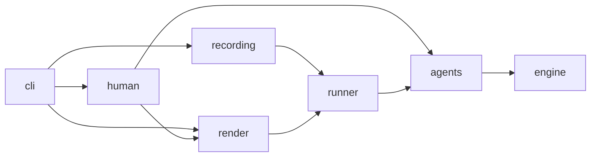

# Hanoi Crossing

A two-player Tower of Hanoi variant with a shared middle pole: a pure Python game
engine, a replay frontend, a random-play frontend, and human play. Built for the
take-home task in [`SPEC.md`](SPEC.md).

**Status:** complete for the required scope (engine, replay CLI, random play,
tests, this README). Web UI, HTTP API, RL wrapper, and LLM agent are described
under [Future work](#future-work) and deliberately not built.

**Contents:** [Quick start](#quick-start) · [The game](#the-game) ·
[Using it](#using-it) · [Design](#design) · [Reuse: RL and service](#reuse-rl-loop-and-simulation-service-not-built) ·
[Beyond the spec](#beyond-the-spec) · [Project notes](#project-notes)

## Quick start

```bash
uv sync
uv run pytest                                  # 210 tests
uv run hanoi replay examples/spec_n1.json      # the spec's N=1 game: A wins
uv run hanoi random --n 3 --seed 7 --trace     # two random players, every turn shown
uv run hanoi play --a human --b random --n 2   # you against a random player
uv run hanoi recordings                        # games saved so far
```

Requires Python 3.12+ and [uv](https://docs.astral.sh/uv/). No runtime dependencies.
Every command, flag, and default is in [`docs/USAGE.md`](docs/USAGE.md).

## The game

Two players, A and B. Each owns a start pole (1a / 1b) and a goal pole (3a / 3b).
The middle pole 2 is shared: both see it and either may lift its top disk. Nobody
sees the other's private poles or hand.

```
        1a
        |
 1b -- [2] -- 3b
        |
        3a
```

A starts with the odd disks (1, 3, 5, …) on 1a, B with the even disks (2, 4, 6, …)
on 1b, N each, largest at the bottom. A disk may only be placed on an empty pole or
on a strictly larger disk. On your turn you do exactly one thing: **lift** the top
disk of a visible pole into your hand, **place** the held disk on a visible pole, or
**skip**. One disk in hand at most. An illegal action changes nothing and the turn
is lost. Turn order is an input, not a rule. You **win** when your hand is empty,
your pole 1 and the shared pole are empty, and your pole 3 has disks.

The spec's own example, N = 1, turn order A B A: A lifts disk 1, B lifts disk 2, A
places disk 1 on 3a and wins. It is [`examples/spec_n1.json`](examples/spec_n1.json)
and the first test in every layer. More recordings in [`examples/`](examples/), each
showing one rule at work (replay any with `uv run hanoi replay examples/<file>`):

| File | What it shows |
|---|---|
| `spec_n1.json` | the spec's example: A wins in three turns |
| `n1_b_wins.json` | same moves, turn order A B B: B wins instead |
| `n2_illegal_and_skip.json` | an illegal move wasted as a turn, a skip, A wins at turn 9 |
| `n1_steal.json` | B takes A's disk off the shared pole and keeps it, then cannot build on it |
| `n2_unfinished.json` | stops early: replay reports unfinished and offers to continue |
| `n3_blocked_win.json` | 44 turns: A's tower is done at turn 31 but B's disk blocks the shared pole; B's own lift at turn 44 hands A the win |

What makes it interesting: the sizes interleave, so A's disk 3 can sit under B's
disk 2; the shared pole is the only scratch pole and both players compete for it;
disks can cross sides for good; an opponent lifting their disk off the shared pole
can hand you the win; and finishing your tower is not enough while anything sits on
pole 2. Watch all of that in one game with
`uv run hanoi replay examples/n3_blocked_win.json --trace`. Every rule as a
checkable item is in [`docs/REQUIREMENTS.md`](docs/REQUIREMENTS.md).

## Using it

One command, `hanoi`. All subcommands build a start state, a schedule, and one agent
per player, then hand those to the single runner.

| Command | What it does |
|---|---|
| `hanoi replay FILE` | re-plays a recording from the initial position, prints the final state; if unfinished, offers to let random agents finish (`--continue` / `--no-continue` pre-answer; never asks with `--json` or without a TTY) |
| `hanoi random --n N` | both players random; same as `play --a random --b random` |
| `hanoi play --a SRC --b SRC --n N` | any mix of `random` and `human`; humans have `--move-timeout` seconds (default 30) before a random move is played for them |
| `hanoi recordings` | lists games autosaved to `recordings/` |

To stop a human game early, type `quit` at the prompt or press Ctrl-C; a human who
ignores three prompts in a row is treated as gone. The game ends as `unfinished`,
is autosaved, and can be continued later with `replay --continue`. Random players
never make illegal moves; only humans and recordings can.

Every flag, default, and exit code is in [`docs/USAGE.md`](docs/USAGE.md), or
`uv run hanoi <command> --help`. Runs are reproducible: `--seed` defaults to 0.

### Output formats

A finished game prints the final board and a summary; `--trace` puts the whole
game first, one line per turn. Towers by default, `--list` for the spec's cross
layout, `--json` for machines. A human turn:

```
Turn 4, player B                     hand: (2)

       |            |            |
       |            |            |
       |            |            |
   ====4====       =1=           |
   ---------    ---------    ---------
     pole 1       pole 2       pole 3

  legal: place 1, place 3, skip       (30 s)
B> place 2
  illegal: disk 2 cannot go on disk 1. Turn wasted.
```

The final board shows both sides, then:
`status won · winner A · played 44 · illegal 2 · skipped 7 · timeouts 0 · unplayed 0`.

## Design

Every decision, with its reason and the alternatives rejected, is numbered in
[`docs/DECISIONS.md`](docs/DECISIONS.md); its index marks where each one came
from: 🟦 required by the spec, 🟨 our reading of a silent rule, 🟪 an engineering
choice within scope, 🟩 an addition beyond the spec. The short version:

### Structure

Four rings; dependencies point inward, and `tests/test_architecture.py` fails on
any import the table in [`CLAUDE.md`](CLAUDE.md) does not allow (D45).



1. **core**: `engine`, the rules, pure.
2. **play**: `agents` and `runner`, who moves and the one loop.
3. **frontends**: `recording` (files), `render` (text), `human` (terminal play).
4. **entry**: `cli`, arguments and wiring only.

Additions beyond the spec live in rings 3 and 4 and never change the engine.

### Interpretations

Where the spec is silent we decided, and wrote it down (I1-I7 in
[`docs/REQUIREMENTS.md`](docs/REQUIREMENTS.md), reasoned in the decision log). The
ones that shape the code: pole 3 must hold a disk to win, so an empty board is not a
win; poles are named from the actor's side, so the opponent's poles cannot even be
addressed; malformed input raises while a legal-looking but illegal move wastes the
turn; a finished game rejects everything; a game ends won, stalemate or unfinished;
both players are checked after every action, because an opponent's move can complete
yours; disk ownership is not tracked after setup.

### Engine (`engine.py`, 263 lines)

Pure functions over an immutable `State`. No I/O, no randomness, no turn counter,
no stored "finished" flag: `winner(state)` is recomputed from the board.

| Function | Purpose |
|---|---|
| `initial_state(n)` | starting position |
| `observe(state, player)` | the partial view that player may see: own 1 and 3, shared 2, own hand |
| `legal_actions(state, player)` | the subset of the seven actions legal now; the action mask |
| `step(state, player, action)` | apply one action; returns a new state and an `Outcome` |
| `winner(state)` | who has won, if anyone |
| `to_dict` | the board as plain JSON data |

The action space is fixed and index-stable: `lift 1..3`, `place 1..3`, `skip`. An
illegal move returns the *same* state object plus a reason, so a wasted turn is
cheap to detect. Disks are plain integers equal to their size. The state hashes by
content, which is what makes stalemate detection a `Counter` lookup.

### Agents (`agents.py`)

An agent answers one question, "how is a move chosen": it receives an `Observation`
and the legal actions and returns an `Action`. It never sees the full state. This is
the contract an RL policy, an LLM, or a network client would implement; the random
agent proves it works. Two kinds live here: `RandomAgent` (seeded) and
`ScriptedAgent` (replays recorded moves verbatim, illegal ones included). Each labels
its moves with a `source` that the runner copies onto the turn. A person at the
keyboard is `HumanAgent` in `human.py`, a frontend: it prompts, and on timeout lets a
fallback agent move for them (labelled `timeout`). Any agent can play either side.

### One runner (`runner.py`)

`play_turn` does observe → choose → step → record for one player. `run` loops it over
an external schedule and stops on a win, a stalemate, or the end of the schedule,
counting the unplayed remainder. Replay, random play, human play, and continuing an
unfinished game are all `run` with different agents and start states. Each `Turn`
records the action, the outcome, and its **source**: human, random, scripted, or
timeout.

### Recording format (`recording.py`)

```json
{"n": 2, "turn_order": "AABBAABAA",
 "moves": ["lift 1", "place 2", "lift 1", "place 2", "lift 1", "place 3", "skip", "lift 2", "place 3"],
 "sources": ["human", "human", "random", "random", "human", "human", "random", "human", "human"]}
```

`turn_order` is a separate field because the spec calls the turn order external.
Moves are player-relative. `sources` is optional and informational. A replay always
restarts from the initial position; the file stores moves, never board states.

## Reuse: RL loop and simulation service (not built)

The spec asks that the engine serve, unchanged, as the core of an RL training loop
or of a service holding many games. Nothing of the sort is built; here is why no
change would be needed.

**RL.** A policy is one more `Agent`: `choose` runs a network over the observation
and picks among the legal actions. The environment wrapper is about thirty lines
outside the engine:

```python
class HanoiEnv:  # sketch, not shipped
    def reset(self, n):
        self.state = initial_state(n)
        return encode(observe(self.state, "A"))  # fixed-size vector

    def step(self, action_index, player):
        action = ALL_ACTIONS[action_index]  # index-stable space of 7
        mask = legal_actions(self.state, player)  # action mask
        self.state, out = step(self.state, player, action)
        reward = 1 if out.winner == player else -1 if out.winner else -0.01
        if not out.legal:
            reward -= 0.1  # trainer's choice, not ours
        return encode(observe(self.state, player)), reward, out.winner is not None, mask
```

The three properties this relies on are already tested: `observe` leaks nothing the
agent may not see, `ALL_ACTIONS` has a fixed order, and `step` never consults who
moved last, so self-play, a random opponent, or any turn schedule are the trainer's
business.

**Service.** A game is a `State` value: immutable, hashable, and one `to_dict`
away from JSON. A server holds `dict[game_id, State]`, applies `step` per request,
and never worries about one request corrupting another. The stage 3 CLI already
drives the engine "one move at a time" through `play_turn`, which is exactly the
shape a request handler has.

## Beyond the spec

### Additions

Marked as such so a reviewer can separate what was asked from what we chose
(A1–A7 in `docs/REQUIREMENTS.md`): human play with a move timeout and random
fallback; per-turn move sources; autosave of every finished game and
`hanoi recordings`; continuing an unfinished replay; ending a game early with
`quit`, Ctrl-C, or repeated timeouts; opt-in stalemate detection; drawn tower
output.

### Rejected alternatives

A mutable `Game` object, a "game type" concept, a player-tagged move list as the
file format, a seed-chosen starter, stalemate detection on by default, writing the
recording after every turn, and Poetry/Docker/HTML docs. Each is in the decision log
with its reason.

### Future work

- **Web UI + HTTP API.** FastAPI in an optional extra; one page with an SVG board;
  endpoints to create a game, load a recording, move, advance bots, continue; raw
  `observe` / `step` endpoints for remote agents. Same engine, agents, and
  `play_turn`, one request per turn instead of a blocking loop.
- **RL.** The wrapper sketched above plus a trainer.
- **LLM agent.** `choose` prompts a local model with the observation and legal
  actions, parses the reply, falls back to skip. Slow and weak at Hanoi; a
  demonstration of the agent seam, not a player.

## Project notes

### Layout, tests, lint

```
SPEC.md               the task, verbatim
docs/REQUIREMENTS.md  spec restated with IDs; interpretations and additions
docs/DECISIONS.md     decision log
docs/USAGE.md         every command, flag, default, exit code
plans/PLAN.md         the stage plan, traceability table, status per stage
examples/             six recordings, each showing one rule; all pinned by tests
src/hanoi_crossing/
  engine.py           rules (263 lines, guarded by a test at < 500)
  agents.py           Random / Scripted agents
  runner.py           play_turn, run, schedules
  recording.py        JSON format, recording files, replay
  render.py           towers, lists, turn lines, summary, JSON result
  human.py            terminal play: console, human agent, timeouts
  cli.py              the hanoi command: arguments and wiring only
tests/                210 tests; the engine is tested directly, the CLI through main();
                      test_architecture.py enforces the import table in CLAUDE.md
```

```bash
uv run pytest
uv run ruff check . && uv run ruff format --check .
uv run pre-commit install        # ruff hooks; no pytest hook, so red TDD commits pass
```

### AI usage

Claude Code (Claude Fable 5.1) was used throughout, under human direction. The
model proposed; the author questioned, changed, or accepted every decision, and the
decision log records which.

- **Planning:** a long design conversation to read the rules, find their edge cases
  (opponent-assisted wins, disks crossing sides, stalemates, timeouts), settle every
  interpretation, and agree the architecture step by step. The plan, the
  requirements doc, and the first twenty decisions came out of it.
- **Stage 0:** scaffold, tooling, and documentation skeleton from the approved plan.
- **Stage 1:** engine tests written first, then the engine, in red/green commit
  pairs. D22–D25.
- **Stage 2:** agents, runner, recording format, same pattern. D26–D31.
- **Stage 3:** renderer and CLI, same pattern; the author approved the tower output
  before it became the golden text. D32–D36.
- **Stage 4:** this README, assembled from the decision log and requirements.
- **After stage 4:** fixes that came from the author playing the game: default
  output, bot turn lines, the `--max-turns` formula measured from random play, the
  repetition limit made opt-in, and ways to end a game early. D38–D44, two of them
  reversing earlier choices.
- **Restructure after review:** the review said the code was not cleanly
  abstracted. With Claude Code (Claude Opus 5) the author kept every feature and
  reorganised the modules into four rings: human play moved out of the CLI into
  `human.py`, the engine now reports which disk moved, duplicated formatting and
  checks collapsed to one place each, and a test enforces the import rules.
  D45–D51. The code went from 1 329 to 1 183 lines without losing a feature.

### Journey

Read [`plans/PLAN.md`](plans/PLAN.md) for the plan as approved, then `git log`: every
unit is a `test:` commit that fails followed by a `feat:` commit that passes, and
each stage ends with a `docs:` commit that logs its decisions.
