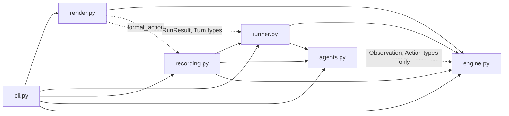
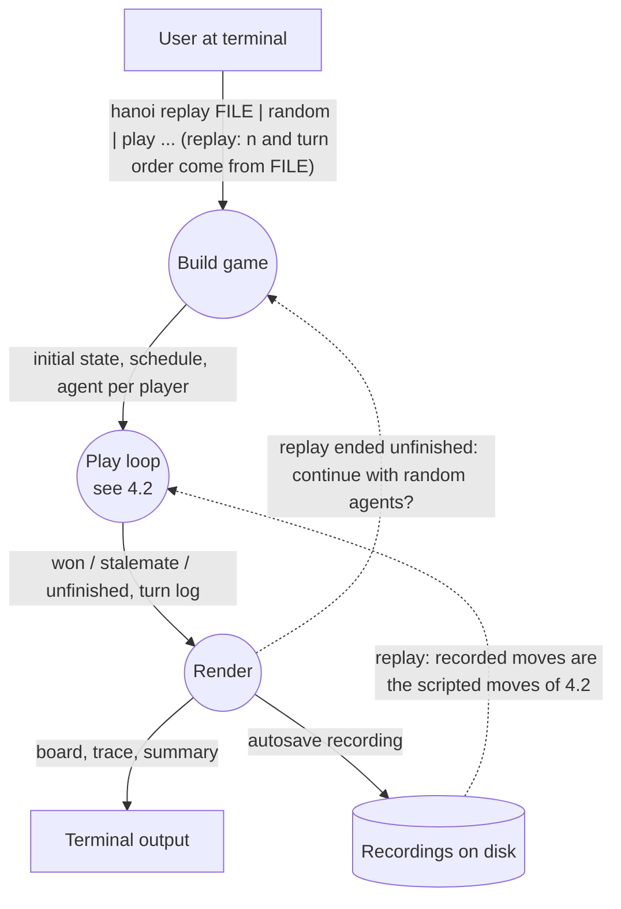
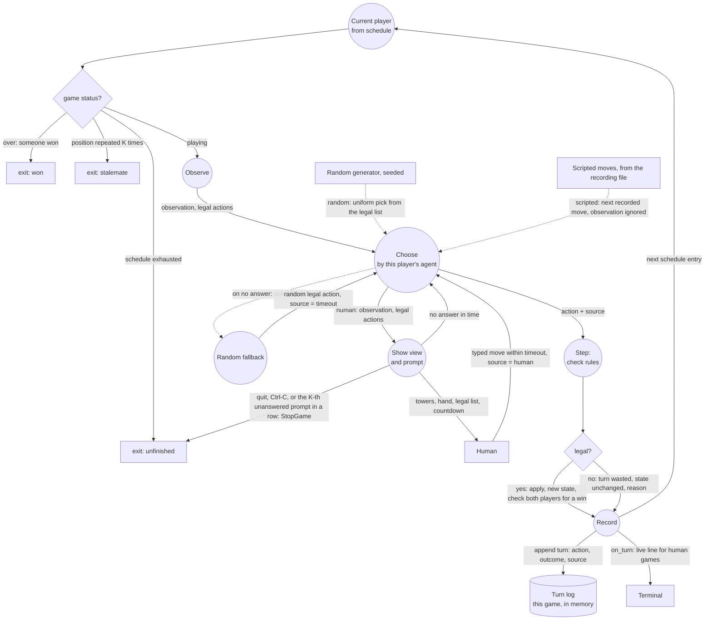

# Hanoi Crossing — plan

The plan as approved before implementation, kept as part of the journey. All stages
are done. It describes the code as it was planned, not as it stands: flags changed
after stage 4 (D38-D44) and the modules were restructured after review (D45-D54), so
`CLAUDE.md` holds the current blueprint, `docs/USAGE.md` the current flags, and
`docs/DECISIONS.md` the reasoning.

## 1. Decisions

### 1.1 Rules as read

- Players A and B; private poles 1 and 3 each; pole 2 shared. A has odd disks, B
  even, N each, on pole 1.
- One action per turn: lift, place, skip. One disk in hand. Size rule on every pole.
  Illegal action: nothing changes, turn lost.
- Turn order is an input; the engine takes the acting player on every call.
- Win: hand empty, own pole 1 empty, pole 2 empty, own pole 3 non-empty. Both
  players checked after every action; first win ends the game; no ties possible.
- Ownership never matters after setup; disks may end up on the other side.

### 1.2 Interpretations (go into `docs/DECISIONS.md` and docstrings)

1. All visible poles empty is not a win; pole 3 must hold a disk.
2. Actions name poles 1–3 from the actor's side; the opponent's poles are inexpressible.
3. Malformed input raises; well-formed but illegal wastes the turn with a reason.
4. A finished game rejects every further action, including skip.
5. Game ends won, stalemate (same position and player to move K times), or
   unfinished (schedule exhausted); later schedule entries count as unplayed.

### 1.3 Tooling and process

- uv; dev deps pytest, ruff, pre-commit (ruff hooks only, so failing-test commits
  pass). `.python-version` 3.12. No Poetry, Docker, or CI.
- TDD visible in git: per unit `test:` (red) then `feat:` (green), optional `refactor:`.
- One stage = one session; it reads its section of `plans/PLAN.md`, implements only
  that, ends with commits, green tests, status line updated, `docs/DECISIONS.md` and
  the README AI-usage log appended. Every decision is logged when made.
- All docs are Markdown: `README.md`, `SPEC.md`, `docs/REQUIREMENTS.md`,
  `docs/DECISIONS.md`, `plans/PLAN.md`.

## 2. Architecture

```
src/hanoi_crossing/
  engine.py     rules; pure functions over an immutable State; < 500 lines   stage 1
  agents.py     how a move is chosen: Agent protocol, Random / Scripted / External  stage 2
  runner.py     the one game loop: play_turn, run, schedules                   stage 2
  recording.py  JSON recording format: parse, validate, write                  stage 2
  render.py     turn view, final board, trace, summary text                    stage 3
  cli.py        hanoi command: args, wiring, stdin prompt, autosave            stage 3
```



Arrows mean "imports and calls"; dotted arrows import types or one helper only.
`render` re-steps recorded turns through the engine to describe them, and reads
`format_action` from `recording`. `recording` calls `runner.run` for `replay` and
wraps loaded moves as scripted agents. `cli` reaches the engine directly for
`initial_state`, `to_dict`, and the pole mapping. Replay is not a separate code
path: it is the same loop with both agents scripted from the file.

Engine holds nothing between calls and never sees where a move came from. Agents
receive only an `Observation` and the legal actions. The runner owns the loop and
the turn log for one game. Frontends hold state between calls.

## 3. Game flow

### 3.1 Whole game



A replay always restarts from the initial position and re-plays the recorded moves.
Continuing an unfinished replay is a second Build with the replayed final state and
two random agents.

### 3.2 Play loop (DFD)



Observe runs on every turn for every agent kind. Unparseable typed text is
re-prompted at no cost (inside Show view and prompt). The prompt detects a timeout
and reports it; Choose invokes the fallback and labels the source `timeout`. The
prompt raises `StopGame` on `quit`, Ctrl-C, or the K-th unanswered prompt in a row;
`run` catches it and returns the game so far as `unfinished` (D44). `on_turn` is
how the CLI prints live during human play without owning a second loop (D32).

### 3.3 Play paths (all implemented, all through the same loop)

| Path | Command | Agent A | Agent B |
|---|---|---|---|
| Replay | `hanoi replay FILE` | Scripted | Scripted |
| Replay + continue | `hanoi replay FILE --continue` | Random | Random |
| Random | `hanoi random --n 3 --seed 7` | Random | Random |
| Human vs random | `hanoi play --a human --b random --n 3 --first A` | External | Random |
| Random vs human | `hanoi play --a random --b human --n 3 --first B` | Random | External |
| Human vs human | `hanoi play --a human --b human --n 2 --first A` | External | External |

## 4. Requirements traceability

| ID | Requirement | Stage | Done |
|---|---|---|---|
| R1 | Two players, 3 poles each, N disks on pole 1, largest at bottom | 1 | ✓ engine tests: initial layouts |
| R2 | Pole 2 shared, both can interact | 1 | ✓ engine test: lift opponent's disk from pole 2 |
| R3 | Opponent's poles 1, 3 and hand are hidden | 1 `observe`; 2 agents see only `Observation` | ✓ engine test: observe hides opponent; agents tests |
| R4 | A odd sizes, B even sizes | 1 | ✓ engine tests: initial layouts |
| R5 | Place only on empty pole or strictly larger disk | 1 | ✓ engine tests: size-rule reasons |
| R6 | Exactly one action per turn: lift, place, skip | 1, 2 | ✓ engine legal_actions; runner one action per entry |
| R7 | At most one disk in hand | 1 | ✓ engine test: hand is not empty |
| R8 | Either player may lift any top disk from pole 2 | 1 | ✓ engine test: either player lifts from pole 2 |
| R9 | Illegal action changes nothing, turn wasted | 1 `step`; 2 runner records it | ✓ engine test: identical object on illegal; runner records wasted turns |
| R10 | Turn order external, no pattern assumed | 1; 2 schedules | ✓ engine solo-solve test; runner schedules |
| R11 | Win condition | 1 `winner` | ✓ engine winner tests |
| R12 | Pole naming 1a, 2, 3a, 1b, 3b | 1; 3 render | ✓ engine pole keys; render board tests |
| R13 | N=1 example plays as written | 1, 2, 3 | ✓ spec_n1.json in engine, runner, recording, CLI tests |
| T1 | Engine in Python | 1 | ✓ engine.py |
| T2 | Replay CLI: moves + turn order in, final state out | 2, 3 | ✓ hanoi replay; recording.replay |
| T3 | Random-play mode | 2, 3 | ✓ hanoi random; RandomAgent |
| T4 | Tests exercise the engine directly | 1 | ✓ tests/test_engine.py, 65 tests |
| T5 | Reusable as RL environment core, unchanged | 1; 4 README | ✓ README Reuse; observe / ALL_ACTIONS / no clock |
| T6 | Reusable as concurrent-service core, unchanged | 1; 4 README | ✓ README Reuse; immutable hashable State, to_dict |
| T7 | Do not build RL or service | all; §6 | ✓ nothing built; README Future work |
| T8 | Random player consumes engine as an external agent would | 2 | ✓ agents.Agent protocol; test never receives a State |
| T9 | Design input, output, internal model | 1, 2, 3 | ✓ engine model, recording format, render output |
| T10 | Decide and document open rules | 1; 4 | ✓ docs/REQUIREMENTS.md I1–I7; engine docstring |
| T11 | README with design decisions | 0; 4 | ✓ README |
| C1 | Engine under 500 lines | 1 | ✓ 267 lines; test guards < 500 |
| C2 | Standard layout, uv | 0 | ✓ uv, src layout |
| S1 | Git repo, journey visible | 0; all | ✓ 25+ commits, red/green pairs |
| S2 | Disclose AI usage | 0; all; 4 | ✓ README AI usage; docs/DECISIONS.md |
| S3 | ~2 h, WIP OK | stages 0–3 are a complete submission | ✓ stages 0–3 complete; stage 4 docs |

## 5. Stages

Each stage: Goal · Deliverables · Tests (written first) · Commits · Done when.

### Stage 0 — Scaffold

**Status:** done

**Goal.** Runnable empty project with docs skeleton. No game logic.

**Deliverables.**
- `git init`; `uv init --package --name hanoi-crossing`; `requires-python >= 3.12`;
  no scripts entry yet.
- `uv add --dev pytest ruff pre-commit`; `[tool.ruff]` line-length 100;
  `.pre-commit-config.yaml` with ruff + ruff-format; `uv run pre-commit install`;
  `.gitignore` adds `recordings/`.
- `src/hanoi_crossing/__init__.py` with `__version__`.
- `SPEC.md` (verbatim spec); `examples/spec_n1.json`
  `{"n":1,"turn_order":"ABA","moves":["lift 1","lift 1","place 3"]}`.
- `docs/REQUIREMENTS.md`: the spec restated under the IDs of §4, plus a final
  "Interpretations and additions" section (§1.2 and everything beyond the spec,
  marked as additions).
- `docs/DECISIONS.md`: numbered log, entry = context · choice · reason · rejected.
  Seeded with §1, §2, the CLI decisions of stage 3, and the future-work choices of
  §6; appended by every later stage.
- `README.md` skeleton: What it is (WIP) · Quick start · Rules (link REQUIREMENTS)
  · Design decisions (link DECISIONS) · Engine · Frontends · Reuse (not built) ·
  AI usage · Layout. AI usage: Claude Code (Fable 5.1) for design discussion, plan,
  and implementation under human direction; log per stage.
- `plans/PLAN.md`: this document from §1 on, with a status line per stage.

**Tests.** `tests/test_smoke.py` asserts `__version__` (red before it exists).

**Commits.** `chore: scaffold uv project` · `docs: add plan, spec, requirements,
decisions`.

**Done when.** `uv run pytest` 1 passed; `uv run ruff check .` clean; both commits
exist; stage 0 marked done.

### Stage 1 — Engine

**Status:** done

**Goal.** `engine.py`: the complete rules as pure functions over an immutable state.

**Hard constraint C1.** `wc -l src/hanoi_crossing/engine.py` < 500, blanks and
docstrings included; enforced by a test written before the engine; target ≈ 250;
nothing engine-related moves elsewhere to dodge it.

**Deliverables.** Frozen dataclasses:
```python
Player = Literal["A", "B"]
Action(verb: "lift"|"place"|"skip", pole: 1|2|3|None)    # pole from actor's side
ALL_ACTIONS: tuple[Action, ...]                           # fixed order, size 7
State(n, poles: {"1a","2","3a","1b","3b": tuple[int,...]}, hands: {Player: int|None})
Observation(poles: {1,2,3: tuple}, hand: int|None)
Outcome(legal: bool, reason: str|None, winner: Player|None, done: bool)
```
Disks are ints = size, bottom→top, no ownership stored. Functions:
- `initial_state(n)`: `n >= 1`; `1a = (2n-1, …, 1)`, `1b = (2n, …, 2)`.
- `observe(state, player)`: own 1 and 3, shared 2, own hand; nothing else.
- `legal_actions(state, player)`: subset of `ALL_ACTIONS` in order; empty if over;
  else always has skip.
- `step(state, player, action)`: (1) over → same state, `"game is over"`, done;
  (2) malformed → `ValueError`; (3) illegal → same object + reason; (4) apply;
  (5) `winner` on the new state for both players.
- `winner(state)`: hand empty, pole 1 empty, pole 2 empty, pole 3 non-empty; A then B.
- `to_dict` / `from_dict`: JSON round trip; `from_dict` validates.
Reasons: `hand is not empty`, `pole p is empty`, `hand is empty`,
`disk d cannot go on disk t`, `game is over`.

**Tests** (`tests/test_engine.py`). Initial layouts, `n=0` raises; observe hides the
opponent; legal_actions at start, after a lift, when over; every reason string;
illegal step returns the identical object; every malformed case raises; lifting and
placing the opponent's disk; N=1 spec example, A wins; `ABB`, B wins; opponent's
lift hands the win; all-empty is not a win; win with an opponent's disk counts;
finished game rejects skip; `AAAA…` solo solve in 2^n−1 moves; seeded random-play
invariants (disk multiset constant, poles strictly decreasing, ≤ 1 winner);
serialization round trip and rejection; line budget.

**Commits** (red then green each). types + initial_state + observe ·
legal_actions + step · winner + both-player check · serialization · invariants +
line budget · refactor.

**Done when.** Tests green; `wc -l` under 500; stage 1 marked done.

### Stage 2 — Agents, runner, recording

**Status:** done

**Goal.** Play a game end to end from Python. Not counted toward C1.

**Deliverables.**

`agents.py`:
```python
class Agent(Protocol):
    kind: str  # "random" | "scripted" | "human"
    last_fell_back: bool

    def choose(self, observation: Observation, legal: Sequence[Action]) -> Action: ...
```
- `RandomAgent(rng, allow_skip=True)`: uniform over `legal`; `allow_skip=False`
  drops skip unless it is the only option.
- `ScriptedAgent(actions)`: next recorded action, ignoring `legal`; raises when
  exhausted.
- `ExternalAgent(ask, timeout=None, fallback=None)`: `ask(observation, legal,
  deadline)` is injected (stdin prompt in the CLI, a fake in tests). On `Timeout`
  it uses `fallback.choose` and sets `last_fell_back`. No I/O or clock in this
  module.
Any agent per player: 3 × 3 combinations, all tested.

`runner.py`:
```python
Turn(index, player, action, outcome, source: "human"|"random"|"scripted"|"timeout")
RunResult(final_state, turns, status: "won"|"unfinished"|"stalemate", winner, unplayed)
play_turn(state, player, agent, index) -> (State, Turn)
run(state, schedule, agents, repetition_limit=None) -> RunResult   # loops play_turn
```
Per schedule entry: status check (won / repeated K times / exhausted) → observe →
legal_actions → choose → step → record. Schedules: `from_string`, `to_string`,
`repeat(pattern, length)`, `rotate_to(pattern, first)`, `random_schedule(rng, length)`.

`recording.py` (format only, not a runner):
```json
{"n": 2, "turn_order": "AABBAABAA", "moves": ["lift 1", "place 2", "skip"],
 "sources": ["human", "human", "timeout"]}
```
`sources` optional (missing → all `scripted`), same length as `moves` if present.
`Recording`, `parse_action` / `format_action`, `load` / `loads` / `dump` / `dumps`,
`RecordingFormatError` (missing keys, `n<1`, letters not A/B, length mismatch, bad
verb, bad pole, skip with pole), `to_agents`, `from_run`, `replay(recording)`.

**Tests** (`test_agents.py`, `test_runner.py`, `test_recording.py`). RandomAgent
picks from legal, never gets a State, seed-reproducible, `allow_skip=False`;
ScriptedAgent order and exhaustion; ExternalAgent returns `ask`'s result, and the
fallback's on `Timeout` with `source="timeout"`; spec N=1 via runner; unplayed
counting; unfinished; stalemate with `repetition_limit=3` on two skipping agents,
unfinished with it off; N=2 example with illegal `place 2`, A wins turn 9; random
vs random N=1..3 seeded finishes with invariants; all 9 agent combinations; every
format error; action string round trip for all 7; dumps/loads round trip; random
game → `from_run` → `replay` → identical final state; `sources` round trip.

**Commits.** agents · runner + schedules · recording · refactor.

**Done when.** Tests green; a random N=3 game can be saved and replayed to the same
final state; stage 2 marked done.

### Stage 3 — CLI

**Status:** done

**Goal.** The spec's two frontends plus human play. Entry point `hanoi`. Follows
§3.1 and §3.2 step for step: Build game (`cli.py`), play loop (`runner.run`),
Render (`render.py`), autosave (`recording.dump`).

**Deliverables.** Commands in spec order; `replay` and `random` are required,
`play` and `recordings` are additions.

Shared flags:

| Flag | Required | Default | What it does |
|---|---|---|---|
| `--json` | optional | off | Machine-readable output; disables prompts. |
| `--list` | optional | off | Bracket lists `[4, 2]` instead of drawn towers. |
| `--trace` | optional | off | One line per turn before the final board (D38, D40). |
| `--seed S` | optional | `0` | Seeds random agents. Same seed, same game; printed. |

`hanoi replay FILE` — reads the file once, restarts from the initial position,
re-plays the moves with two scripted agents, prints the final state. If unfinished
and stdin is a TTY: `Game unfinished. Let random players finish it? [y/N]`.

| Flag | Required | Default | What it does |
|---|---|---|---|
| `FILE` | required | — | Recording JSON; pick one with `hanoi recordings`. |
| `--continue` / `--no-continue` | optional | ask if TTY, else no | Pre-answer the prompt. |
| `--schedule P` | optional | `AB` | Continuation pattern, from the player after the last recorded turn. |
| `--max-turns N` | optional | `200 · 3^n` | Continuation length (D41). |
| `--repetition-limit K` | optional | off | Stalemate detection when given (D42). |

`hanoi random --n N` — both players random; same as `play --a random --b random`.

| Flag | Required | Default | What it does |
|---|---|---|---|
| `--n N` | required | — | Disks per player. |
| `--first A\|B` | optional | `A` | Who takes turn 1; rotates the pattern to that player's first occurrence (`AAB` → `BAA`). Error if absent from the pattern. |
| `--schedule P` | optional | `AB` | Pattern repeated to fill `--max-turns`; A/B only; printed before turn 1. |
| `--max-turns N` | optional | `200 · 3^n` | Schedule length; reaching it ends `unfinished` (D41). |
| `--repetition-limit K` | optional | off | `stalemate` when a position with the same player to move recurs K times; off unless given (D42). |
| `--no-skip` | optional | off | Random agents skip only when nothing else is legal. |
| `--save FILE` | optional | autosave `recordings/<date>-<mode>-n<N>-seed<S>.json` | Every finished game (any status) is written once at the end; path printed. `--save` names it. |
| `--no-save` | optional | off | Write nothing. |

`hanoi play --a SRC --b SRC --n N` — any mix; `SRC` is `random` or `human`.

| Flag | Required | Default | What it does |
|---|---|---|---|
| `--a`, `--b` | required | — | Move source per player; passing one twice is an error. |
| `--move-timeout S` | optional | `30` | Seconds for a human to answer; then a random legal move is played, marked `timeout`; `0` disables. |
| others | optional | as `random` | `--first`, `--schedule`, `--max-turns`, `--repetition-limit`, `--no-skip`, `--save`, `--no-save`. |

`hanoi recordings [--dir recordings/]` — lists saved games: file, date, mode, n,
seed, status, turns.

Human turn (golden text; tower style default):
```
Turn 4, player B                     hand: (2)

      |          |          |
      |          |          |
   ===4===      =1=         |
   -------    -------    -------
   pole 1     pole 2     pole 3

  legal: place 1, place 3, skip       (30 s)
B> place 2
  illegal: disk 2 cannot go on disk 1. Turn wasted.
```
Header line first: `Hanoi Crossing  n=2  seed=0  schedule=AB (repeats, max 1000
turns)` and `A: human   B: random`. Bot turns print one line. Timeout prints
`time is up: random move played for B: lift 1   [timeout]`. `--list` shows
`pole 1: [4]   pole 2: [1]   pole 3: []`. Unparseable text re-prompts free. Two
humans on one terminal see each other's turns (documented).

Tower rules: disk d = d `=` each side of the digit, centred; column width
2·(2n)+3; height 2n rows; empty rows `|`.

Final output: towers for A's side (1a, 2, 3a) above B's side (1b, 2, 3b), hands,
summary `status won|unfinished|stalemate · winner · played · illegal · skipped ·
timeouts · unplayed`, autosave path. `--json`: `to_dict(state)` + status, winner,
counts, turns with `source`, seed, schedule. `--trace`: `idx player action → result
[source]`; `[human]`/`[timeout]` always shown, others only in mixed games.

Stdin timeout: reader thread + `queue.get(timeout)`. Exit codes: 0 ok, 1 bad
recording, 2 bad arguments.

**Tests** (`test_cli.py`, `test_render.py`; `cli.main(argv)` with captured stdout
and injected stdin). Replay of `examples/spec_n1.json` prints A wins; `--json`
matches `to_dict`; truncated recording → unfinished, no prompt without a TTY;
`--continue` finishes it; `random --seed 1` twice identical; autosave path printed
and replays to the same state, `--save` renames, `--no-save` writes nothing;
`--schedule AAB` → A A B A A B; `--first B` → B A B A; `--first B --schedule A` →
exit 2; human vs random with scripted stdin incl. one illegal and one unparseable
line; `--move-timeout 0.1` with no input → `[timeout]` and counted; tower golden
strings for n=1..3; `--list` golden; `hanoi recordings` lists the autosaved file;
exit codes.

**Commits.** render · replay · play/random · continue prompt · autosave +
recordings · refactor.

**Done when.** Tests green; the spec example and a random game run from the
terminal; stage 3 marked done.

### Stage 4 — Write-up

**Status:** done

**Goal.** The README the spec asks for, built from `docs/DECISIONS.md` and
`docs/REQUIREMENTS.md`.

**Deliverables.** README sections: what it is and quick start (`uv sync`,
`uv run pytest`, the three commands) · rules with the board diagram and N=1 example
· interpretations · design (engine API, agents, one runner, recording format,
output formats with an example) · reuse, nothing built (RL wrapper pseudo-code:
reset = `initial_state`, observation encoding, action index into `ALL_ACTIONS`,
mask = `legal_actions`, `step` + trainer's reward, any opponent agent, any
schedule; service reuse via immutable state and `to_dict`) · additions beyond the
spec, marked · rejected alternatives · layout, tests, lint · AI usage per stage ·
journey (`plans/PLAN.md`, `git log`). Traceability rows checked off; engine line
count stated.

**Tests.** None new; full suite green.

**Commits.** `docs: README design and reuse` · `docs: AI usage and journey` ·
`docs: traceability check-off`.

**Done when.** README complete; stage 4 marked done.

## 6. Future work (explained in the README, not implemented)

- **Web UI + HTTP API.** FastAPI in an optional extra; one HTML page with an SVG
  board; endpoints to create a game, load a recording, move, advance bots, continue,
  list recordings; raw `observe` / `step` endpoints for remote agents; server-side
  move deadline. Same engine, agents, and `play_turn`; one request per turn instead
  of a blocking loop.
- **RL.** A policy is one more `Agent`; a ~30-line environment wrapper over the
  engine (see stage 4 README section). Nothing in the engine changes.
- **LLM agent.** `choose` prompts a local model with the observation and legal
  actions, parses the reply, falls back to skip. Optional dependency; mocked tests.
- **Headless use.** In-process: the engine's own functions. Remote: the HTTP API.
